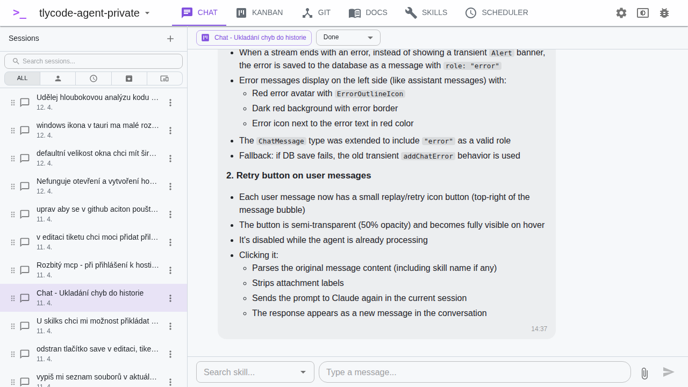

# Chat

The Chat view is the primary interface for interacting with Claude AI.

## Sessions

The left sidebar shows your chat sessions:

- Click **+ New Chat** to create a new session
- Click a session to open it
- Use the **search bar** to filter sessions by name
- Filter by type: **All**, **User**, **Scheduler**, **Archive**
- Active sessions (with ongoing AI responses) show a spinner indicator — even across projects
- Right-click or use the menu to rename, archive, or delete a session

## Sending Messages

1. Type your message in the text input at the bottom
2. Optionally select a **Skill** from the dropdown to provide additional context
3. Click **Send** or press Enter

The skill's content is sent as a system prompt (`--append-system-prompt`) — Claude receives it as additional instructions alongside your message.

## Streaming Responses

Claude's response streams in real-time:

- **Thinking phase** — Claude is processing (spinner shown)
- **Text** — response text appears progressively
- **Actions** — thinking blocks and tool calls are shown as collapsible sections
  - The collapse state is persisted per message — if you collapse an actions block, it stays collapsed across sessions

## Attachments

Click the **paperclip icon** to attach files to your message:

- **Source code** (`.rs`, `.ts`, `.py`, etc.) — content is read and included inline in the prompt
- **Text files** (`.md`, `.txt`, `.json`) — content is included inline
- **Binary files** — file metadata (name, size, type) is described to Claude

Files are automatically copied to the application data directory for persistence. Pending attachments (not yet sent) can be removed before sending.

## Permissions

When running in **Default** or **Plan** permission mode, Claude may ask for permission before modifying files or running commands. A permission prompt appears in the chat — click **Allow** or **Deny**.

In **Automatic** mode, Claude runs without asking (the `--dangerously-skip-permissions` flag is used).

## Error Messages

If Claude encounters an error, the error is saved as a message in the conversation history with a distinct style. Each error message has a **Retry** button that lets you resend the original prompt.

## Cross-Navigation with Kanban

- From a chat session, click **Create Ticket** to create a Kanban ticket linked to the conversation
- If a chat session is linked to a ticket, a link to that ticket appears at the top of the chat
- Clicking the link navigates directly to the Kanban view and opens the ticket dialog

## Diff Review

When Claude makes code changes, a **Diff Review Panel** can display the changes with syntax highlighting. You can add inline comments on specific lines of added, deleted, or context code.

## Session Continuity

Each chat session maintains a Claude CLI session ID. When you reopen a session and send a new message, the conversation continues from where it left off (using `--resume`).
