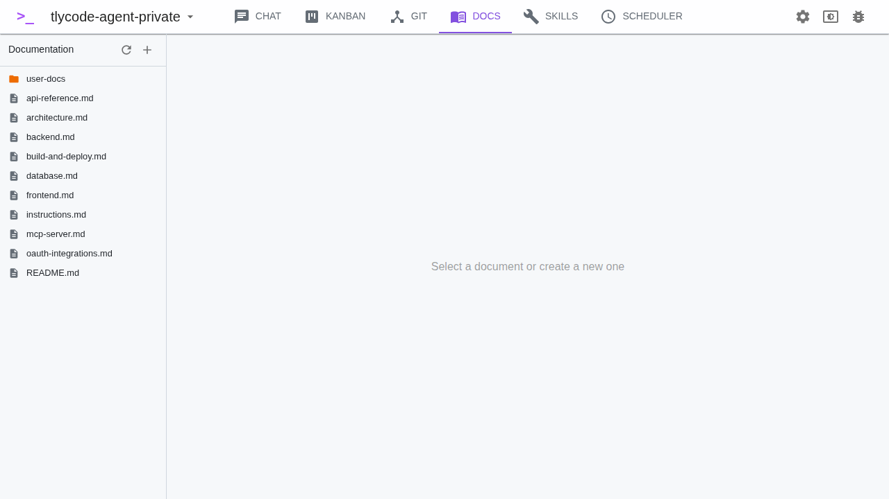

# Documentation

The Docs view lets you browse and edit markdown documentation in your project's `docs/` folder.

## File Tree

The left panel shows a tree of all documentation files:

- `.md`, `.mdx`, and `.txt` files are shown
- Image files (`.png`, `.jpg`, etc.) are shown but not editable
- Folders are listed first, then files (alphabetically sorted)
- Hidden files (starting with `.`) are excluded

## Editing

Click a file to open it in the editor:

- Edit the content directly in the text area
- Changes are auto-saved
- Markdown is rendered with support for **Mermaid diagrams** — fenced code blocks with `mermaid` language are rendered as diagrams

## Managing Files

- Click the **+** button to create a new file or folder
- Right-click a file to rename or delete it
- Click **Refresh** to reload the file tree
- Folders can be created and deleted recursively
