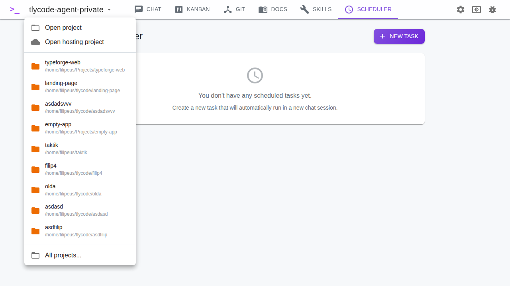
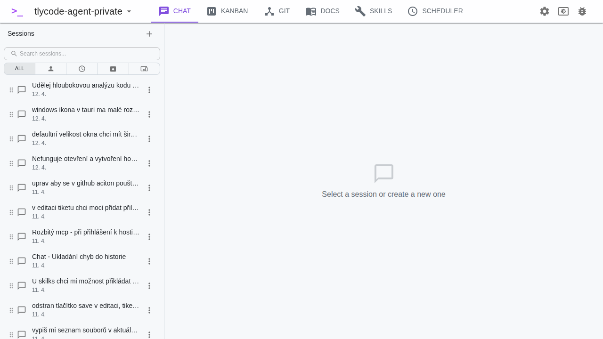

# Getting Started

## System Check

On first launch, TlyCode Agent checks that required tools are installed:

- **Claude CLI** — the AI engine (or other supported CLI agents)
- **Node.js** — required by Claude CLI
- **GitHub CLI** — for Git authentication (optional)

The system check also detects Gemini CLI, Codex CLI, and Copilot CLI if installed. If all required tools are present and authenticated, the check passes automatically. Otherwise, you can authenticate directly from the check screen or click **Skip**.

## Selecting a Project

After the system check, you'll see the **Project Selector**:

### Hosting Projects

At the top of the project selector, you can connect to **TlyCode Hosting** via OAuth. After authenticating:

- Browse your hosting projects from the dropdown
- **Create new** hosting projects with a name and description
- **Open** a hosting project locally (clones the repository)
- GitHub CLI authentication is required for deploy operations

See [OAuth & Hosting](./oauth-hosting.md) for details.

### Recent Projects

Below the hosting section, your recently opened projects are listed (up to 10). Click any project to open it immediately. Use the **X** button to remove a project from the list.

### Open Project

Click **Open Project** to browse the file system:

- Use the **breadcrumb navigation** at the top to jump to any parent directory
- Click a **folder** to navigate into it
- Click the **Home** button to go to your home directory
- Type a path directly into the breadcrumb bar
- Click **Select this folder** to open the current directory as your project

## Main Interface

After selecting a project, you'll see the main application interface:

The top toolbar contains:

- **Project name** — click to switch projects
- **Tab navigation** — Chat, Kanban, Git, Docs, Skills, Scheduler
- **Settings** (gear icon) — application configuration
- **Theme** (sun/moon icon) — switch between light, dark, and system theme
- **Report a Bug** — link to GitHub issues
