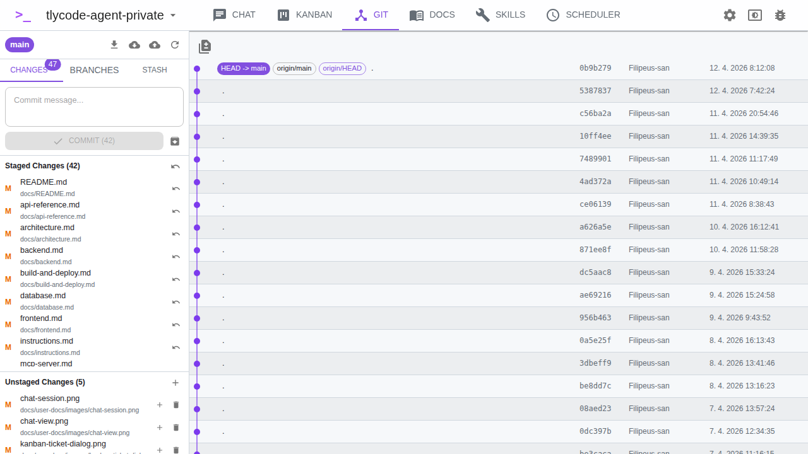

# Git Integration

The Git view provides a full Git client within the application.

## Status Bar

The top bar shows:

- **Current branch** name
- **Fetch**, **Pull**, **Push** buttons for remote operations
- **Refresh** button

## Tabs

### Changes

Shows modified, added, deleted, and untracked files:

- **Staged Changes** — files ready to commit
- **Unstaged Changes** — modified files not yet staged
- Click **Stage** on a file to add it to staging
- Click **Discard** to revert changes
- Use **Stage all** to stage everything at once
- Write a commit message and click **Commit**
- Click **Stash changes** to temporarily save changes

### Branches

Lists all local and remote branches:

- Click a branch to check it out
- Create new branches
- Delete branches (with optional force delete)
- **Merge** a branch into the current branch
- **Rebase** the current branch onto another (supports `--onto`)

### Stash

Lists saved stashes:

- **Pop** to restore and remove a stash
- **Drop** to delete a stash

## Commit History

The right panel shows the commit log with a visual branch graph:

- Commit hash, author, date, message
- Tags and branch refs
- Click a commit to see changed files with additions/deletions counts
- Click a file to view its diff

## Merge, Rebase & Cherry-Pick

All three operations are fully supported with:

- **Start** — initiate the operation
- **Abort** — cancel and revert to previous state
- **Continue** — proceed after resolving conflicts
- **Status detection** — the UI shows when an operation is in progress

## Conflict Resolution

When merge/rebase/cherry-pick conflicts occur, a conflict resolution interface appears:

- View conflicting files with conflict markers highlighted
- Choose **Ours** — keep your version
- Choose **Theirs** — accept the incoming version
- Choose **Manual** — edit the content yourself
- After resolving all conflicts, continue the operation
