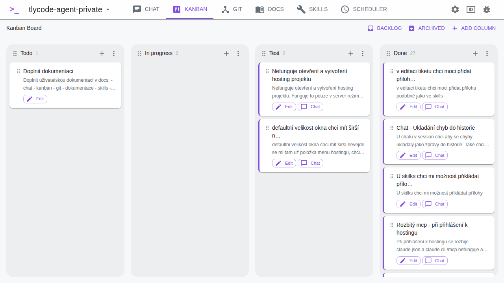
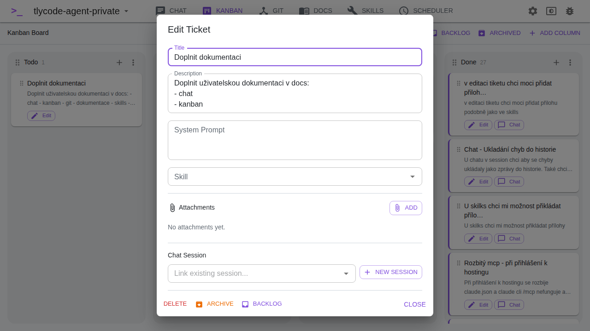

# Kanban Board

The Kanban board helps you track tasks and organize your work.

## Columns

By default, three columns are created: **To Do**, **In Progress**, **Done**.

- Click **Add Column** to create a new column
- Click a column title to rename it
- Drag columns to reorder them
- Delete a column via its menu (all tickets in it will be removed)

## Tickets

- Click **Add ticket** (+ button) on a column to create a new ticket
- Click **Edit** on a ticket to open the ticket dialog
- **Drag and drop** tickets between columns to change their status

### Ticket Dialog

The ticket dialog lets you edit all ticket properties:

- **Title** — the ticket name
- **Description** — detailed description of the task (markdown supported)
- **System Prompt** — a custom system prompt that will be sent to Claude when running this ticket
- **Skill** — attach a skill to use as context when running the ticket
- **Attachments** — upload file attachments to the ticket (stored as base64)
- **Chat Session** — link to an existing chat session or create a new one
- **Comments** — add comments to the ticket for discussion or notes

### Running a Ticket

When a ticket has a description, system prompt, or skill, you can run it directly — this creates a new chat session with the ticket's context and sends the description as a prompt to Claude.

## Backlog

Click the **Backlog** button to manage tickets that aren't on the board yet. Backlog supports search and pagination. Tickets can be moved between backlog and the board.

## Archive

Click **Archived** to view and restore archived tickets. Archive also supports search and pagination. When a ticket is archived, its linked chat session is also archived.

## Column Prompts

In **Settings**, you can configure a prompt and skill for each column. When a ticket is moved to a column that has a prompt configured, the prompt is automatically sent to the ticket's linked chat session.

## Cross-Navigation with Chat

- Click the **chat link** on a ticket to navigate directly to its linked chat session
- From a chat session, the linked ticket is shown at the top with a link back to the Kanban view
