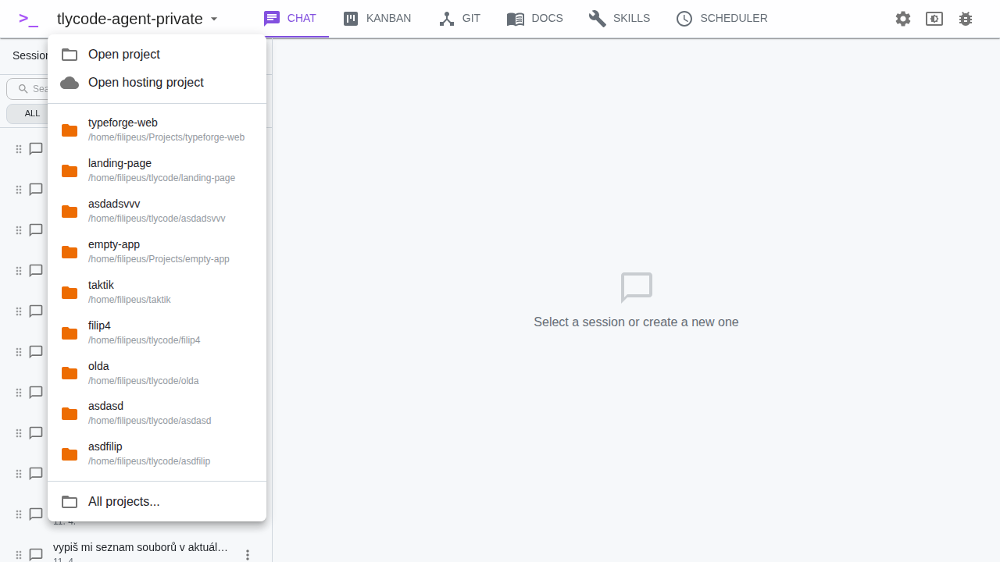
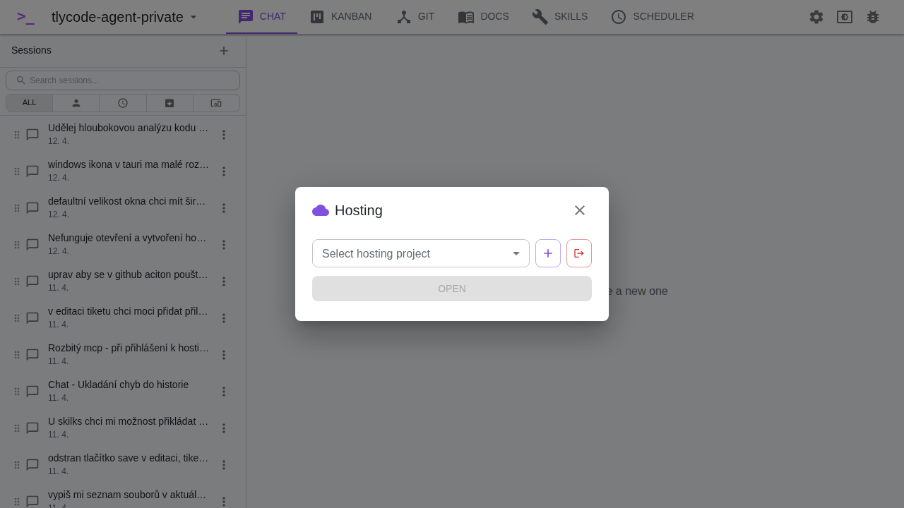
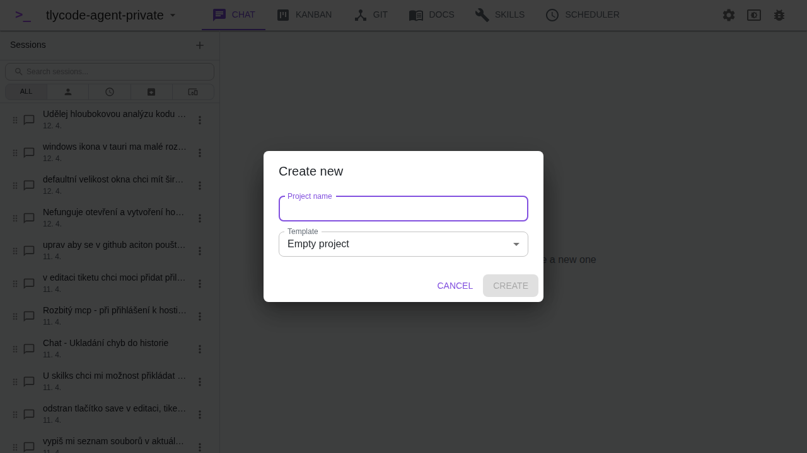

# OAuth & Hosting

TlyCode Agent integrates with the **TlyCode Hosting** platform, allowing you to create, manage, and open cloud-hosted projects directly from the application.

## Accessing Hosting

There are two ways to open the hosting dialog:

1. Click the **project name** in the toolbar and select **Open hosting project** from the dropdown menu

2. On the initial **Project Selector** screen, the hosting section is displayed at the top

## Signing In

When you open the hosting dialog for the first time, you need to authenticate with TlyCode Hosting via OAuth:

1. Click **Sign in to TlyCode Hosting**
2. A browser window/tab opens with the TlyCode authorization page
3. Log in with your TlyCode account (or [register](https://tlycode.ai/register) if you don't have one)
4. Authorize TlyCode Agent to access your hosting projects
5. After successful authorization, the browser shows a success page
6. The app automatically detects the completed authentication and loads your projects

While waiting for authorization, the button shows **Waiting for authorization in your browser...** with a spinner. The polling timeout is 5 minutes.

> **Note:** If you don't have a TlyCode account yet, click the **Register** link below the sign-in button to create one. You can also click **Learn about hosting** for more information about the hosting platform.

## Managing Hosting Projects

After signing in, the hosting dialog shows your projects:

The dialog contains:

- **Project dropdown** — select an existing hosting project from the list
- **Create new** (+) — create a new hosting project
- **Sign out** (logout icon) — disconnect from TlyCode Hosting
- **Open** — open the selected project locally

### Opening an Existing Project

1. Select a project from the **Select hosting project** dropdown
2. Click **Open**
3. The application prepares a local folder, clones the repository from GitHub, and opens the project

> **GitHub CLI Required:** Opening a hosting project requires GitHub CLI (`gh`) to be authenticated. If it's not, you'll see a warning: *"Sign in to GitHub CLI to clone repositories"* with a **Sign in to GitHub** button. Click it to authenticate.

> **GitHub CLI Not Installed:** If GitHub CLI is not installed at all, you'll see: *"GitHub CLI (gh) is not installed"*. Install it from [cli.github.com](https://cli.github.com/) first.

### Creating a New Project

1. Click the **+** button next to the project dropdown
2. The **Create new** dialog appears:

3. Enter a **Project name**
4. Select a **Template** (currently "Empty project" is available)
5. Click **Create**

After creation:

- A local folder is prepared for the project in the TlyCode projects directory
- The project opens in TlyCode Agent
- A new chat session is automatically created with setup instructions
- Claude AI guides you through the initial project setup (GitHub repository creation, environment configuration, deployment)

### Signing Out

Click the **Sign out** button (logout icon, red) in the hosting dialog. This removes the TlyCode hosting connection by deleting the "tlycode" MCP server configuration from `~/.claude.json`.

## How It Works Under the Hood

### OAuth 2.0 with PKCE

The authentication uses OAuth 2.0 Authorization Code flow with PKCE (Proof Key for Code Exchange):

1. **Discovery** — the app fetches OAuth metadata from the hosting server's `/.well-known/oauth-authorization-server` endpoint
2. **Dynamic Client Registration** (RFC 7591) — the app automatically registers itself as an OAuth client
3. **Authorization** — a PKCE code challenge is generated and the user is redirected to the authorization page
4. **Callback** — after authorization, the callback is handled by:
   - **Desktop mode:** a temporary local HTTP server on a random port
   - **Server mode:** an Actix-web route at `GET /oauth/callback`
5. **Token Exchange** — the authorization code is exchanged for access and refresh tokens
6. **Storage** — tokens are stored in `~/.claude.json` alongside the MCP server configuration

### Token Refresh

Access tokens expire after a set period. TlyCode Agent automatically refreshes them using the stored refresh token when making API calls. No manual re-authentication is needed unless the refresh token itself expires.

### MCP Integration

After authentication, the hosting platform's MCP server is registered as "tlycode" in `~/.claude.json`. This means:

- Claude Code and other MCP-compatible agents can interact with TlyCode Hosting directly
- The hosting MCP server provides tools for managing projects, deployments, databases, domains, and more
- Tokens are refreshed automatically when needed

## Troubleshooting

| Problem | Solution |
|---------|----------|
| "Sign in failed" | Check your internet connection and try again. The authorization page must be accessible. |
| "Sign in to GitHub CLI to clone repositories" | Click the **Sign in to GitHub** button, or run `gh auth login` in your terminal. |
| "GitHub CLI (gh) is not installed" | Install GitHub CLI from [cli.github.com](https://cli.github.com/). |
| Authorization times out | The polling timeout is 5 minutes. If it expires, click **Sign in to TlyCode Hosting** again. |
| Projects don't load after sign-in | Close and reopen the hosting dialog. If the issue persists, sign out and sign in again. |
