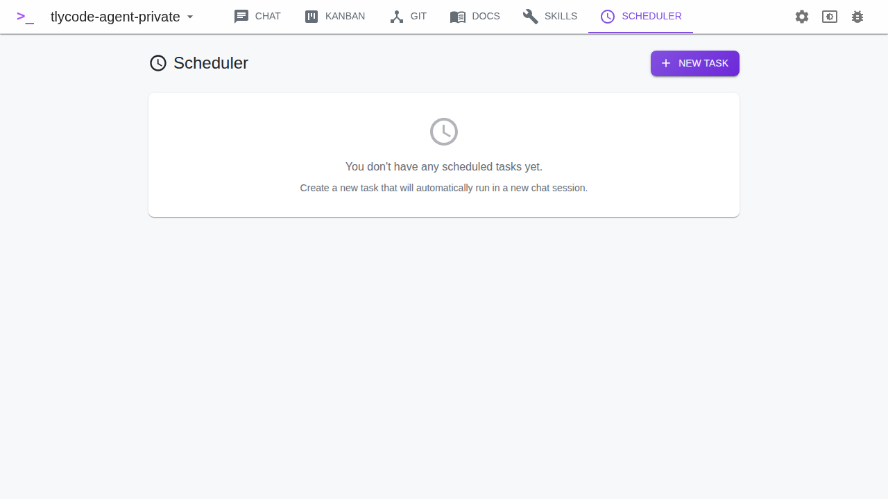

# Scheduler

The Scheduler lets you create tasks that run automatically at set intervals, each creating a new chat session with Claude.

## Creating a Task

1. Click **New Task**
2. Configure:
   - **Skill** (optional) — a skill to use as context
   - **Message** — the prompt to send to Claude
   - **Interval** — how often to run, with presets:
     - 1 minute, 5 minutes, 10 minutes, 30 minutes
     - 1 hour, 6 hours, 12 hours, 24 hours
   - **Notify** — send a system notification when the task runs (desktop only)
3. The task is created and starts running immediately

## How It Works

The scheduler runs a background loop every 30 seconds. For each enabled task, it checks whether enough time has passed since the last run. If so, it:

1. Creates a new chat session titled `[Scheduler] <skill-name>`
2. Sends the message to Claude with the skill as system prompt
3. Updates the task's last run time
4. Optionally sends a system notification

## Managing Tasks

- **Enable/Disable** — toggle a task on or off with the switch
- **Edit** — change the message, interval, or skill
- **Delete** — remove the task permanently
- **Run Now** — manually trigger a task immediately (creates a new session regardless of the interval)

## Viewing Results

Scheduler-created sessions appear in the Chat sidebar. Use the **Scheduler** filter in the chat view to see only scheduler-generated sessions.
