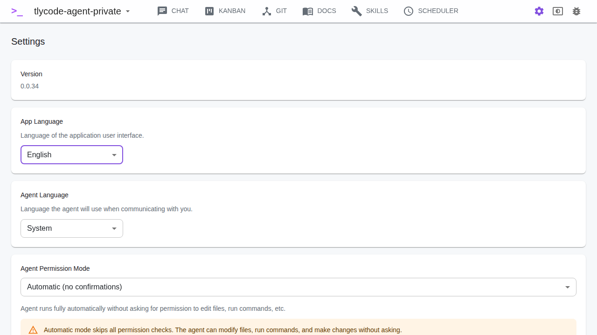

# Settings

## Application Language

Select the language for the UI. Available: Czech (Čeština) and English.

## Agent Language

Select the language Claude will use in responses. This is independent of the UI language.

## Agent Permission Mode

Controls how Claude handles file modifications and command execution:

- **Default** — Claude asks for permission before each action (interactive approval via the chat UI)
- **Plan** — Claude creates a plan first, then asks for approval before executing
- **Automatic (Fully automatic)** — Claude runs without any permission checks. A warning is shown — use with caution as Claude will modify files and run commands without confirmation.

## CLI Agent

Select which CLI agent to use for AI operations. Default is **Claude CLI** (`claude`). Other supported agents (if installed) include Gemini CLI, Codex CLI, and Copilot CLI.

## Launch at Startup

Enable to start TlyCode Agent automatically when the system boots. Desktop only.

## System Check

Click **Run System Check** to re-check the installation status of Claude CLI, Node.js, GitHub CLI, and other supported tools.

## Append Prompt

A text that is prepended to the beginning of every chat prompt. Useful for project-wide instructions. You can also select a **Skill** to use as additional context for all messages.

## First Message Prompt

A text that is added to the beginning of the first message in every new chat session. Useful for onboarding instructions. Also supports an optional skill.

## Column Prompts

Configure a prompt and skill for each Kanban column. When a ticket is moved to a column with a configured prompt, the prompt is automatically sent to the ticket's linked chat session. This enables automated workflows — e.g., when a ticket moves to "In Progress", Claude automatically starts working on it.

## Log Level

Set the verbosity of debug logs:

- **Error** — only errors
- **Warning** — errors and warnings
- **Info** — general information
- **Debug** — detailed debug output
- **Trace** — everything, including throttling and scroll events

## Environment Variables

Define environment variables that will be set when Claude runs commands:

- Click **Add** to create a new variable
- Variables are synchronized with the `.env` file in the project directory
- Useful for API keys, custom paths, configuration values
- Changes are saved immediately

## MCP Servers

Configure Model Context Protocol servers that extend Claude's capabilities:

- **Local (stdio)** — a command that runs locally (e.g. `npx -y @modelcontextprotocol/server-name`)
- **HTTP** — a remote MCP server URL with optional headers
- **HTTP with OAuth** — remote servers that require OAuth authentication

Servers are stored in `~/.claude.json`:
- Global servers (like "tlycode") are in the root scope
- Project-specific servers are under `projects.<project_path>`

To add a server:

1. Choose transport type (Local or HTTP)
2. Enter the command/URL and arguments
3. Optionally add environment variables or headers
4. Click **Add Server**

Servers can be edited or deleted from the list.

### Built-in tlycode-agent Server

TlyCode Agent automatically registers its own MCP server named **tlycode-agent** when a project is loaded. This server provides 60+ tools for controlling chat, kanban, scheduler, skills, git, docs, pipelines and settings — allowing external agents like Claude Code to interact with the application.

See [MCP Server](./mcp-server.md) for full documentation.
