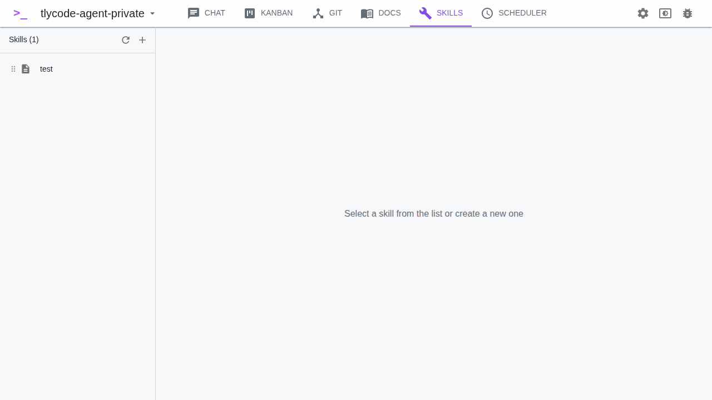
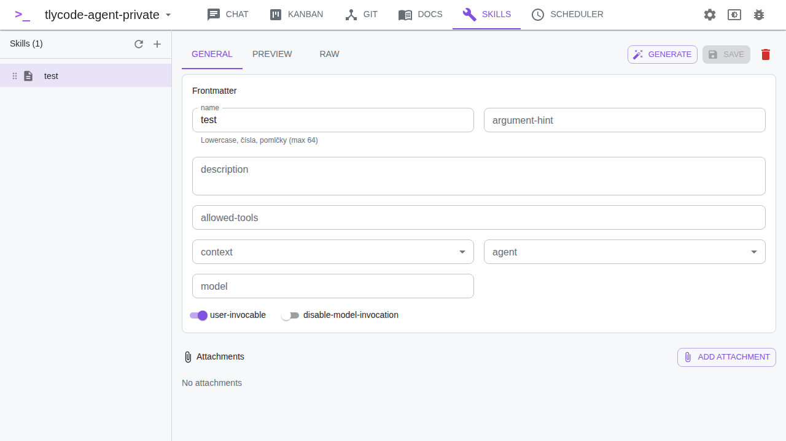

# Skills

Skills are reusable prompts/instructions that can be attached to chat messages to give Claude specific context.

## What is a Skill?

A Skill is a `SKILL.md` file stored in your project's `.claude/skills/<skill-name>/` directory. When you select a skill in the chat, its content is sent as a system prompt to Claude.

Skills can contain:

- Code style guidelines
- Project-specific instructions
- Task templates
- Domain knowledge

## Skill Editor

The editor has three tabs:

### Metadata

The metadata tab shows a form for YAML frontmatter fields:

| Field | Description |
|-------|-------------|
| **Name** | Display name of the skill |
| **Description** | Short description |
| **Allowed Tools** | Comma-separated list of tools Claude can use |
| **Model** | Specific Claude model to use (optional) |
| **Context** | `inline` (default) or `fork` — how the skill runs |
| **Agent** | Agent to use (optional) |
| **User Invocable** | Whether users can invoke this skill directly |
| **Disable Model Invocation** | Prevent the model from auto-invoking this skill |
| **Argument Hint** | Hint text for the skill argument |

### Markdown

Raw markdown editor for the skill body (the actual prompt content).

### Preview

Rendered preview of the full SKILL.md file including frontmatter.

## Skill Attachments

Skills can have file attachments stored in `.claude/skills/<skill-name>/attachments/`:

- Click **Attach File** to upload a file (stored as base64)
- Attachments are listed with their file name and size
- Delete attachments you no longer need

Attachments provide additional context that Claude can reference when the skill is used.

## Managing Skills

- Click **New skill** to create a new skill
- Click a skill in the list to view/edit it
- Use the **Refresh** button to reload the skill list
- Right-click a skill to rename or delete it

## Using Skills

### In Chat

1. Open a chat session
2. Click the **Skill** dropdown above the message input
3. Select a skill
4. Type your message and send

The skill content is sent as a system prompt via `--append-system-prompt`.

### In Kanban Tickets

Assign a skill to a ticket in the ticket dialog. When the ticket is run, the skill provides context for Claude.

### In Scheduler Tasks

Select a skill when creating a scheduler task. The skill provides context for each scheduled execution.

### In Column Prompts

In Settings, assign a skill to a Kanban column prompt. When a ticket moves to that column, the skill is used as context.
